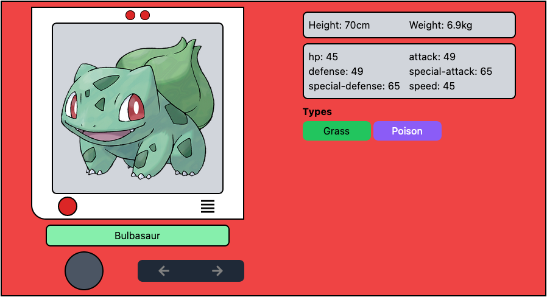

# React Pokedex

This project was bootstraped with [Vite](https://vitejs.dev/), using [React](https://reactjs.org/), [Redux](https://redux.js.org/), [Redux Toolkit](https://redux-toolkit.js.org/) and [Tailwind](https://tailwindcss.tw/).

## API Used

[PokiAPI](https://pokeapi.co/docs/v2)

## Screenshot

## Available Scripts

In the project directory, you can run:

### `npm run dev`

Runs the app in development mode.\
Open [http://localhost:5173](http://localhost:5173) to view it in your browser.

The page will reload when you make changes.\
You may also see any lint errors in the console.

### `npm run build`

Builds the app for production to the `dist` folder.\
It correctly bundles React in production mode and optimizes the build for best performance.

## Learn More

You can learn more in the [Vite documentation](https://vitejs.dev/guide/).

## To be developed

-   Search function
-   Complete Pokedex UI
